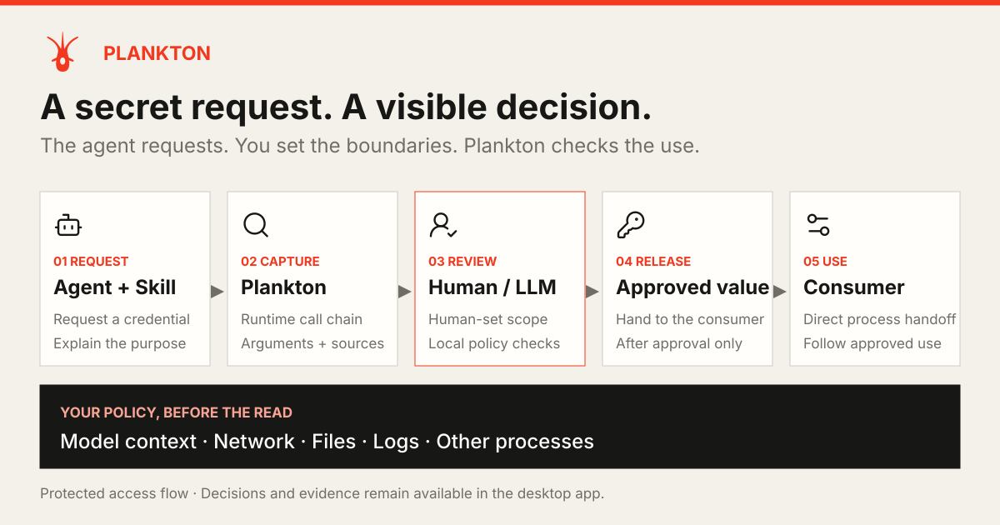
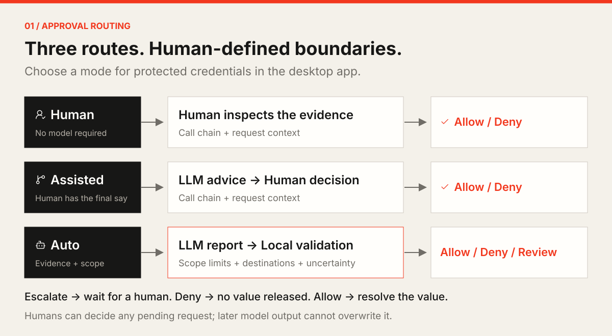
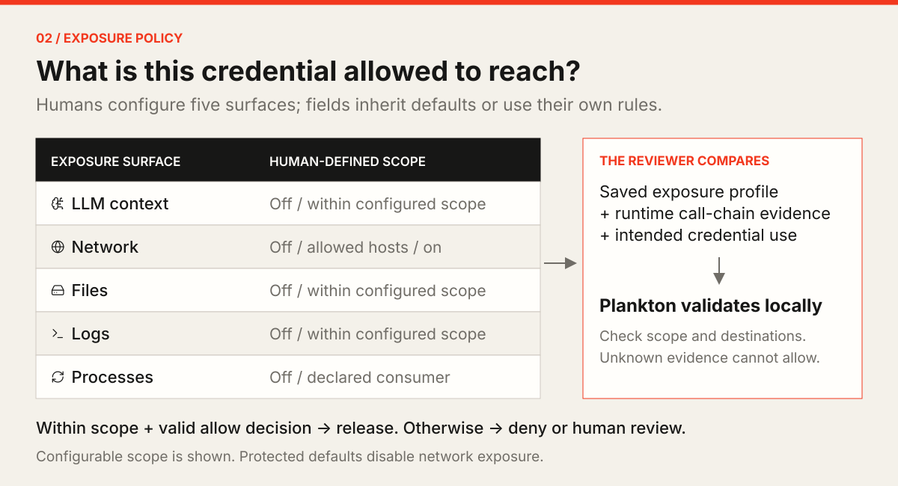
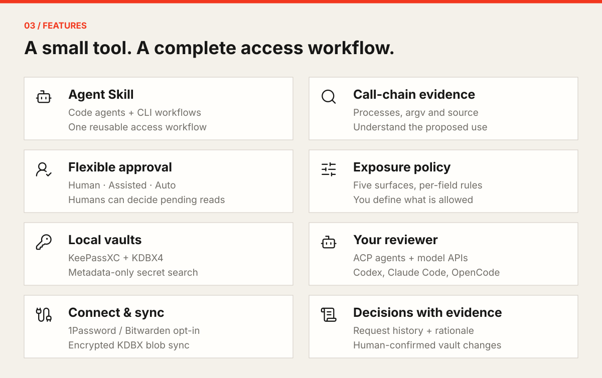
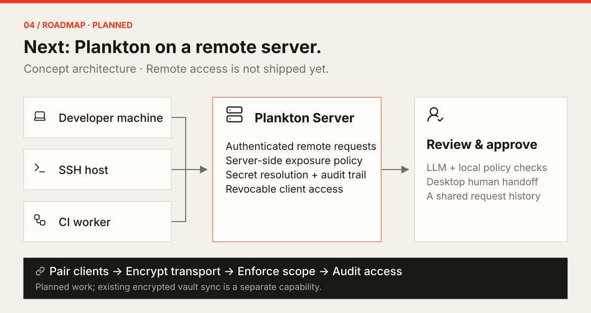

<p align="center">
  
</p>

<h1 align="center">Plankton</h1>
<p align="center"><strong>Secrets for agents. Boundaries set by you.</strong></p>
<p align="center">A local-first password vault and approval console for code agents, LLMs, and automated workflows.</p>
<p align="center">
  <a href="./README.md">English</a> <a href="./README.zh-CN.md">简体中文</a>
</p>
<p align="center">
  <a href="./LICENSE"></a>
  <a href="https://github.com/FlowaveLab/Plankton/actions/workflows/ci.yml"></a>
  <a href="./.codex/skills/secret-access/SKILL.md"></a>
</p>
<p align="center">
  <a href="#how-it-works">How it works</a> <a href="#quick-start">Quick Start</a> <a href="#features">Features</a> <a href="#roadmap">Roadmap</a> <a href="#contributing">Contributing</a>
</p>

**Agent requests → Plankton captures the call chain → Human / LLM reviews → Approved value is delivered.**

You define where a credential may be exposed. The LLM assesses its use; local policy governs automatic release.



<a id="how-it-works"></a>

## Choose who reviews



> **Human** decides directly · **Assisted** adds LLM advice · **Auto** requires local validation. Humans can decide pending requests at any time.

## Your scope. The LLM's review.



> Out-of-scope use or unknown decision evidence cannot automatically allow access. Diagrams show **Protected** credential flows; explicitly **Direct** fields skip approval. See the [approval model](./docs/access-model.md).

<a id="features"></a>

## What you get



<a id="quick-start"></a>

## Quick Start — install the Skill

With Node.js and `npx` available, install through [Vercel Skills](https://github.com/vercel-labs/skills):

```bash
npx skills add FlowaveLab/Plankton --skill secret-access
```

<details>
<summary>Select agents / install globally / use the embedded Skill</summary>

```bash
npx skills add FlowaveLab/Plankton --skill secret-access --global --agent codex --agent claude-code
```

Already have the Plankton CLI? Install its matching embedded Skill:

```bash
plankton skill install --agent codex --agent claude-code
```

The embedded installer uses a pinned Vercel Skills CLI, requires Node.js 18+, and disables its upstream telemetry. `plankton skill` prints the embedded instructions.

</details>

These commands install the Skill. App and CLI installation, provider setup, and examples live in the [usage guide](./docs/usage.md); the Skill also includes installation guidance.

<a id="roadmap"></a>

## Roadmap / TODO



- [x] Local vaults, call-chain evidence, three review modes, and exposure policy.
- [x] Agent Skill, optional backends, encrypted sync, and audit records.
- [] **Remote Server support** — server deployment and remote requests from developer machines, SSH hosts, and CI.
- [] **Remote approval & policy** — authenticated pairing, encrypted transport, human handoff, server-side scope validation, and audit.
- [] **Self-hosting & operations** — deployment guides, client revocation, recovery, and end-to-end verification.

Unchecked items are planned. Existing encrypted vault sync does not provide remote-server access. [Share your use case](https://github.com/FlowaveLab/Plankton/issues).

## Docs & contribution

[Usage guide](./docs/usage.md) · [Approval model & trust boundaries](./docs/access-model.md) · [Skill](./.codex/skills/secret-access/SKILL.md) · [Approval contract](./docs/automatic-approval.md) · [Runbook](./docs/operator-runbook.md)

<details>
<summary>Understand the data boundaries</summary>

- Successful `plankton get` output is the raw secret. The Skill directs it to a consumer that does not echo or log it, keeping it out of model-visible terminal output.
- Current review evidence retains unredacted arguments, supplied environment values, metadata, and source evidence. Keep credentials out of those fields.
- Review LLMs can use tools to inspect files and run commands. Plankton assumes a trusted local machine and is not an execution sandbox; local-first does not mean every review is offline.

Read the [trust and data boundaries](./docs/access-model.md) for details.

</details>

<a id="contributing"></a>

<details>
<summary>Contribute & develop locally</summary>

Documentation, bug fixes, agent integrations, and remote-server design contributions are welcome. Start larger changes with an [issue](https://github.com/FlowaveLab/Plankton/issues); include reproduction steps and redacted diagnostics in reports.

Use the pinned [Rust toolchain](./rust-toolchain.toml), [Node version](./.nvmrc), and Tauri's native prerequisites:

```bash
git clone https://github.com/FlowaveLab/Plankton.git
cd Plankton
git switch dev
make install
mkdir -p .plankton
export PLANKTON_DATABASE_URL="sqlite://$PWD/.plankton/local.db"
make tauri-dev
```

Run `make check` for code changes. Use synthetic credentials in tests and examples.

</details>

## Open source & acknowledgments

[MIT License](./LICENSE) · Rust + Tauri + React · [KeePassXC engine & licensing](./engines/keepassxc/README.md)

Built by OpenAquarium, with thanks to the open-source agent and password-management ecosystems.
