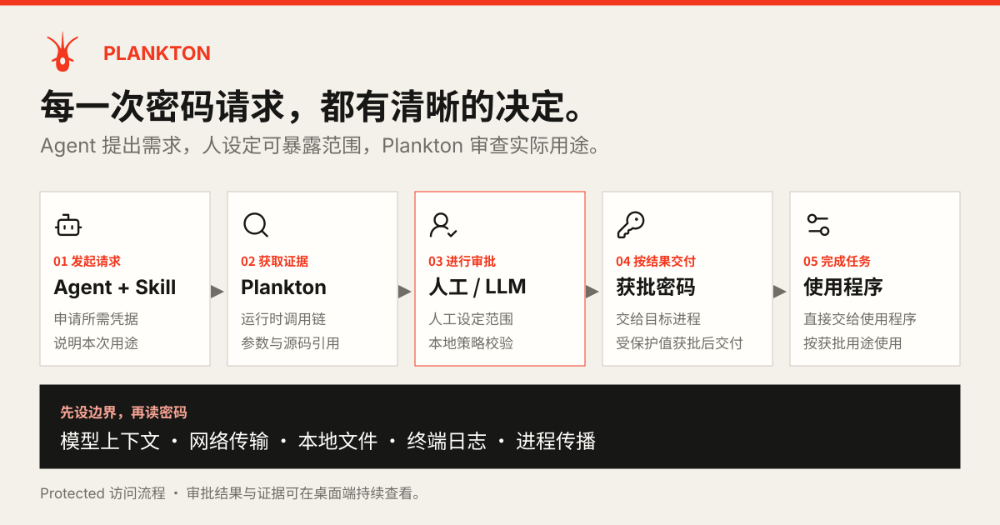
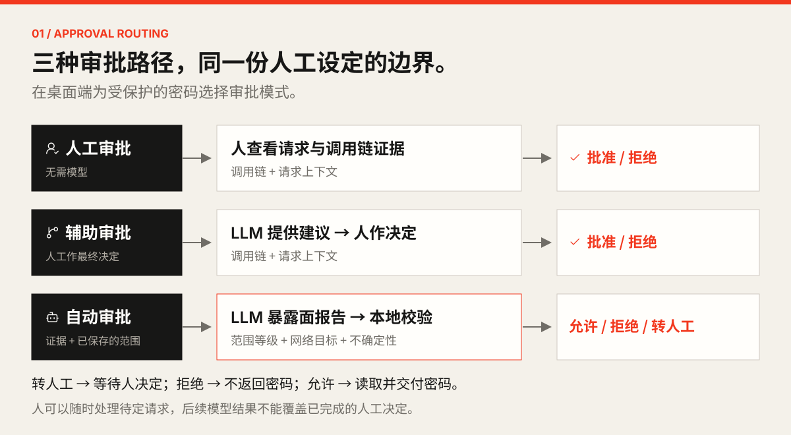
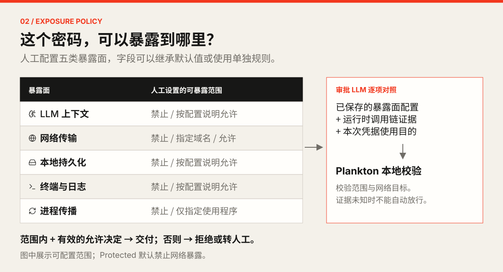
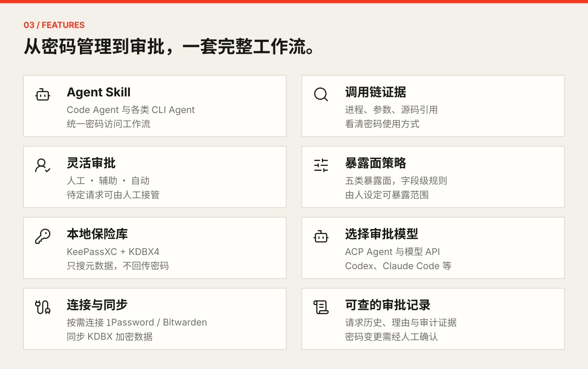
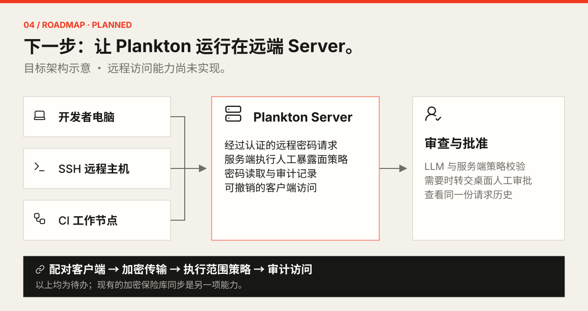

<p align="center">
  
</p>

<h1 align="center">Plankton</h1>
<p align="center"><strong>让 Agent 使用密码，由你设定边界。</strong></p>
<p align="center">面向 Code Agent、LLM 和自动化工作流的本地优先密码保险库与审批控制台。</p>
<p align="center">
  <a href="./README.md">English</a> <a href="./README.zh-CN.md">简体中文</a>
</p>
<p align="center">
  <a href="./LICENSE"></a>
  <a href="https://github.com/FlowaveLab/Plankton/actions/workflows/ci.yml"></a>
  <a href="./.codex/skills/secret-access/SKILL.md"></a>
</p>
<p align="center">
  <a href="#how-it-works">工作流程</a> <a href="#quick-start">快速开始</a> <a href="#features">功能列表</a> <a href="#roadmap">路线图</a> <a href="#contributing">参与贡献</a>
</p>

**Agent 申请密码 → Plankton 获取调用链 → 人工 / LLM 审批 → 获批后交付。**

LLM 依据人工设置的可暴露范围审查用途，本地策略校验决定能否自动放行。



<a id="how-it-works"></a>

## 谁来审批？由你选择



> **人工**直接决定 · **辅助**先看 LLM 建议 · **自动**必须通过本地校验。人可随时处理待定请求。

## 人设范围，LLM 按范围审查



> 超出范围或关键证据未知时，不能自动放行。图中展示 **Protected** 密码流程；显式设为 **Direct** 的字段跳过审批。详见[审批机制](./docs/access-model.zh-CN.md)。

<a id="features"></a>

## 开箱即用的能力



<a id="quick-start"></a>

## Quick Start — 安装 Skill

准备好 Node.js 与 `npx`，通过 [Vercel Skills](https://github.com/vercel-labs/skills) 安装：

```bash
npx skills add FlowaveLab/Plankton --skill secret-access
```

<details>
<summary>指定 Agent / 全局安装 / 使用内嵌 Skill</summary>

```bash
npx skills add FlowaveLab/Plankton --skill secret-access --global --agent codex --agent claude-code
```

已安装 Plankton CLI 时，也可安装与该版本一致的内嵌 Skill：

```bash
plankton skill install --agent codex --agent claude-code
```

内嵌安装器使用固定版本的 Vercel Skills CLI，需要 Node.js 18+，并关闭其上游遥测。`plankton skill` 可查看内嵌说明。

</details>

这里安装的是 Skill。Plankton 应用与 CLI 的安装、模型配置和使用示例见[使用指南](./docs/usage.zh-CN.md)，Skill 内也有安装指引。

<a id="roadmap"></a>

## Roadmap / TODO



- [x] 本地保险库、调用链、三种审批与暴露面策略。
- [x] Agent Skill、可选后端、加密同步与审计。
- [] **远端 Server 支持**：服务端部署，开发机 / SSH / CI 远程请求。
- [] **远程审批与策略**：认证配对、加密传输、人工审批、服务端范围校验及审计。
- [] **自托管与运维**：部署指南、客户端权限撤销、故障恢复与端到端验证。

未勾选项为计划能力；现有加密保险库同步不等于远端 Server 支持。欢迎[提出场景](https://github.com/FlowaveLab/Plankton/issues)。

## 文档与贡献

[使用指南](./docs/usage.zh-CN.md) · [审批机制与信任边界](./docs/access-model.zh-CN.md) · [Skill](./.codex/skills/secret-access/SKILL.md) · [审批契约](./docs/automatic-approval.md) · [运维手册](./docs/operator-runbook.md)

<details>
<summary>使用前了解数据边界</summary>

- `plankton get` 成功时输出原始密码；Skill 要求直接交给不会回显或记录的程序，避免进入模型可见的终端输出。
- 当前审批证据保留未脱敏的参数、传入环境值、元数据和源码；不要把密码放进这些字段。
- 审批 LLM 可用工具读文件、执行命令。Plankton 面向可信本机，不是执行沙箱；本地优先也不代表所有审批离线进行。

完整定义见[信任与数据边界](./docs/access-model.zh-CN.md)。

</details>

<a id="contributing"></a>

<details>
<summary>参与贡献与本地开发</summary>

欢迎文档、Bug 修复、Agent 集成和远端 Server 设计贡献。较大改动请先[开 Issue](https://github.com/FlowaveLab/Plankton/issues) 讨论；反馈中请附复现步骤和已脱敏诊断。

使用仓库 [Rust 工具链](./rust-toolchain.toml)、[Node 版本](./.nvmrc) 与 Tauri 所需系统依赖：

```bash
git clone https://github.com/FlowaveLab/Plankton.git
cd Plankton
git switch dev
make install
mkdir -p .plankton
export PLANKTON_DATABASE_URL="sqlite://$PWD/.plankton/local.db"
make tauri-dev
```

代码变更运行 `make check`；测试与示例请使用示例凭据。

</details>

## 开源与致谢

[MIT License](./LICENSE) · Rust + Tauri + React · [KeePassXC 引擎与许可证](./engines/keepassxc/README.md)

由 OpenAquarium 构建，感谢开源 Agent 与密码管理生态。
